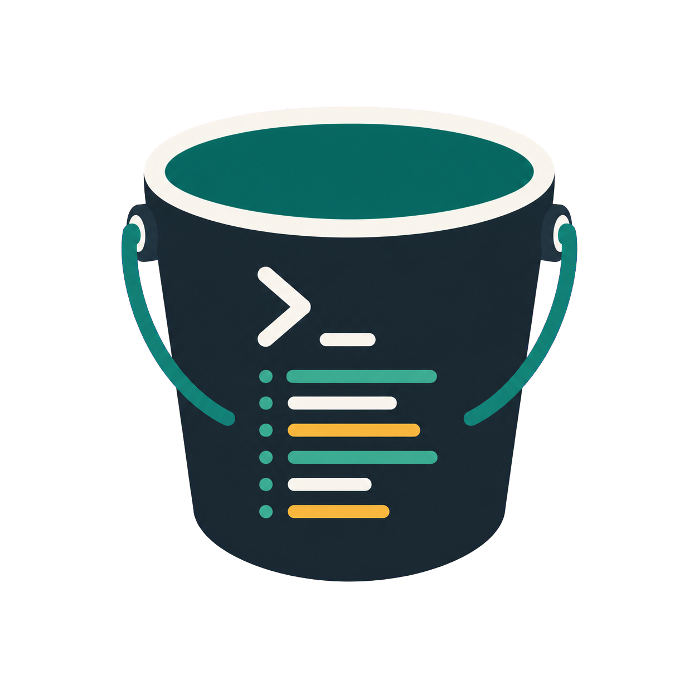

<p align="center">
  
</p>

<h1 align="center">Bucket Command</h1>

<p align="center">
  A local command library for developers who want their command notes searchable, organized, and safe by default.
</p>

<p align="center">
  <a href="https://github.com/cristianoDencode/bucket-command/actions/workflows/ci.yml">
    
  </a>
</p>

Bucket Command is a local command library for developers. It helps you save, organize, search, document, and copy the commands you use often, without turning your notes into something that can execute code behind your back.

The same library is available from a terminal CLI and an Electron desktop dashboard. Data stays on your machine in SQLite, and exports/backups are plain JSON files you control.

## Highlights

- Store commands with title, content, category, language, alias, and notes.
- Browse, edit, search, filter, and copy commands from a desktop dashboard.
- Use the CLI for fast terminal workflows and shell composition.
- Keep scratch notes in the desktop dashboard and save useful snippets into the command library.
- Group commands into categories with optional icons.
- Create command sequences for ordered Bash or PowerShell workflows.
- Export, import, and back up the local library as readable JSON.
- Keep everything local: no accounts, no cloud SDKs, no direct uploads.
- Treat stored command content as documentation only. Bucket Command does not execute stored commands.

## Table of Contents

- [Status](#status)
- [Requirements](#requirements)
- [Quick Start](#quick-start)
- [Desktop Dashboard](#desktop-dashboard)
- [CLI Usage](#cli-usage)
- [Data Storage](#data-storage)
- [Export, Import, and Backup](#export-import-and-backup)
- [Security Model](#security-model)
- [Project Structure](#project-structure)
- [Development](#development)
- [Packaging](#packaging)
- [CI and Release](#ci-and-release)
- [License](#license)

## Status

Bucket Command is an MVP focused on local documentation, search, and backup for developer commands.

Shell targets and languages are stored as metadata. The application can print or copy command text, but it does not provide a command runner.

## Requirements

- Node.js 22 or newer
- npm
- Git
- Linux for the current desktop development and E2E flow

Windows packaging is available through `electron-builder`, but the current local desktop start and E2E scripts are optimized for Linux-style environments.

## Quick Start

Clone the repository, install dependencies, and build the project:

```bash
git clone https://github.com/cristianoDencode/bucket-command.git
cd bucket-command
npm install
npm run build
```

Run the CLI from the local install:

```bash
node_modules/.bin/bucket-command help
```

During local development, you can also link the CLI globally:

```bash
npm link
bucket-command help
```

Remove the global development link later with:

```bash
npm unlink -g bucket-command
```

## Desktop Dashboard

Start the Electron dashboard:

```bash
npm run desktop:start
```

The dashboard uses the same local SQLite library as the CLI. Commands created in the CLI appear in the dashboard, and commands edited in the dashboard are available to CLI commands immediately.

The dashboard currently supports:

- Command browsing, editing, filtering, copying, and deletion.
- Category creation, editing, icon selection, and deletion.
- Scratch notes with autosave.
- Saving note content into the command library.
- Library export, import, and manual backup.
- Automatic backup preferences.

## CLI Usage

Create a category:

```bash
bucket-command category add --name git --icon git
```

Category names are limited to 40 characters. Icons are optional and can be one of:

```text
folder, terminal, git, database, docker, code, server, shield, package, globe
```

Save a command:

```bash
bucket-command command add \
  --title "Git status" \
  --content "git status" \
  --category git \
  --language bash \
  --alias gst \
  --note "Show the working tree status"
```

Show a stored command without executing it:

```bash
bucket-command command show gst
```

Print only the command text:

```bash
bucket-command command get gst --raw
```

Search commands:

```bash
bucket-command command search git
```

Filter commands:

```bash
bucket-command command list --category git --language bash
```

Create a sequence:

```bash
bucket-command sequence add \
  --title "Git daily check" \
  --category git \
  --shell bash \
  --alias git-daily \
  --items gst,glog
```

List and inspect sequences:

```bash
bucket-command sequence list
bucket-command sequence show git-daily
```

Supported command languages:

```text
bash, powershell, javascript, typescript, json, sql, php, python, html, css,
yaml, markdown, other
```

For command actions, `--shell` is still accepted as an alias for `--language` to preserve older scripts. Sequence actions use `--shell` and are limited to `bash` or `powershell`.

## Data Storage

Bucket Command stores data in the user data directory for the current operating system. The storage layer uses SQLite.

For isolated development or tests, set `BUCKET_COMMAND_DATA_DIR`:

```bash
BUCKET_COMMAND_DATA_DIR=/tmp/bucket-command-dev bucket-command command list
```

The dashboard can use the same override:

```bash
BUCKET_COMMAND_DATA_DIR=/tmp/bucket-command-dev npm run desktop:start
```

To reset local app data on Linux after exporting or backing up anything you want to keep:

```bash
rm -rf ~/.local/share/bucket-command
```

## Export, Import, and Backup

Export the library:

```bash
bucket-command library export --output ./bucket-command-library.json
```

Import a Bucket Command JSON export into another local data directory:

```bash
bucket-command library import --input ./bucket-command-library.json
```

Create a timestamped local backup. The output can be a `.json` file or a folder:

```bash
bucket-command library backup --output ~/Backups
```

Library files use a versioned UTF-8 JSON format:

```json
{
  "format": "bucket-command-library",
  "version": 1,
  "exportedAt": "2026-07-28T00:00:00.000Z",
  "categories": [],
  "commands": [],
  "sequences": [],
  "annotations": []
}
```

Bucket Command does not log in to Google Drive, OneDrive, Dropbox, or any other provider. To keep a cloud copy, choose a local folder already synchronized by your provider's desktop app.

## Security Model

- Stored command content is documentation.
- `get`, `show`, `list`, `search`, raw output, and dashboard copy actions do not execute shell commands.
- The CLI and dashboard do not expose command execution or shell profile shortcuts.
- Export, import, and backup are local file operations only.
- There is no OAuth, cloud SDK, token storage, or direct upload.
- Electron uses `contextIsolation`, renderer sandboxing, and a narrow preload API.
- The renderer has no direct access to Node.js, SQLite, or shell execution.

## Project Structure

```text
apps/cli -----------\
                    > packages/core -> packages/storage -> SQLite
apps/desktop -------/
     renderer -> preload -> main -> core
```

Workspace packages:

- `packages/core`: domain entities, validation, errors, and use cases.
- `packages/storage`: SQLite schema, migrations, data path resolution, preferences, import/export, and storage adapter.
- `apps/cli`: Node.js command-line interface.
- `apps/desktop`: Electron, React, and Vite desktop dashboard.

## Development

Install dependencies:

```bash
npm install
```

Run the main local checks:

```bash
npm run lint
npm run typecheck
npm test
npm run build
```

Run the desktop E2E flow:

```bash
npm run e2e
```

Run the Electron desktop E2E in Docker with Xvfb:

```bash
docker compose -f docker-compose.e2e.yaml run --rm desktop-e2e
```

The compose service uses Node.js 22, runs as the non-root `node` user to stay close to GitHub Actions, and limits the E2E run to 240 seconds. Failure artifacts are written to `test-results/desktop-e2e-docker/`.

## Packaging

Build a Linux `.deb` package:

```bash
npm run package:linux
```

Build a Windows installer:

```bash
npm run package:win
```

Generated packages are written to `release/`.

Example Linux package name:

```text
release/Bucket-Command-0.1.0-amd64.deb
```

Install the Linux package locally:

```bash
sudo apt install ./release/Bucket-Command-0.1.0-amd64.deb
```

If you prefer `dpkg`, install the package and then resolve missing system dependencies if needed:

```bash
sudo dpkg -i ./release/Bucket-Command-0.1.0-amd64.deb
sudo apt -f install
```

After installation, Bucket Command appears in the application menu as a desktop app. The installed app keeps using the normal user data directory and does not depend on the repository checkout.

Remove the installed package:

```bash
sudo apt remove bucket-command
```

## CI and Release

GitHub Actions workflows live in `.github/workflows`.

- `CI` runs on pushes and pull requests to `main`.
- `CI` installs dependencies with `npm ci`, then runs lint, typecheck, tests, build, and Electron E2E on Linux with `xvfb`.
- `Release` runs on tags matching `v*` or manually through `workflow_dispatch`.
- `Release` validates the project and uploads a `.tar.gz` build artifact.

Create a release artifact by pushing a version tag:

```bash
git tag v0.1.0
git push origin v0.1.0
```

## License

No license file is currently included. Add a license before accepting outside contributions or publishing reusable packages.

## Notes

- `npm run desktop:start` removes `ELECTRON_RUN_AS_NODE` for local Electron runs because some development environments set it automatically.
- The script uses `--no-sandbox` so Electron can start in common local Linux development environments. The app window itself still keeps renderer isolation enabled.
